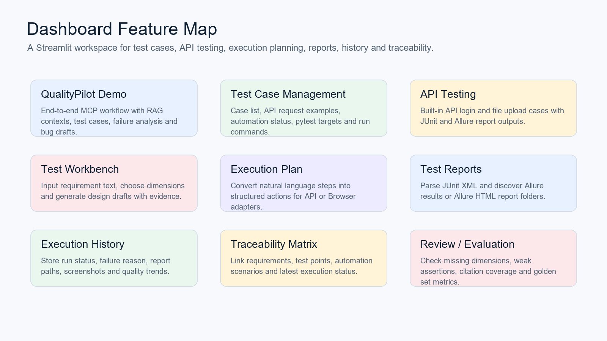
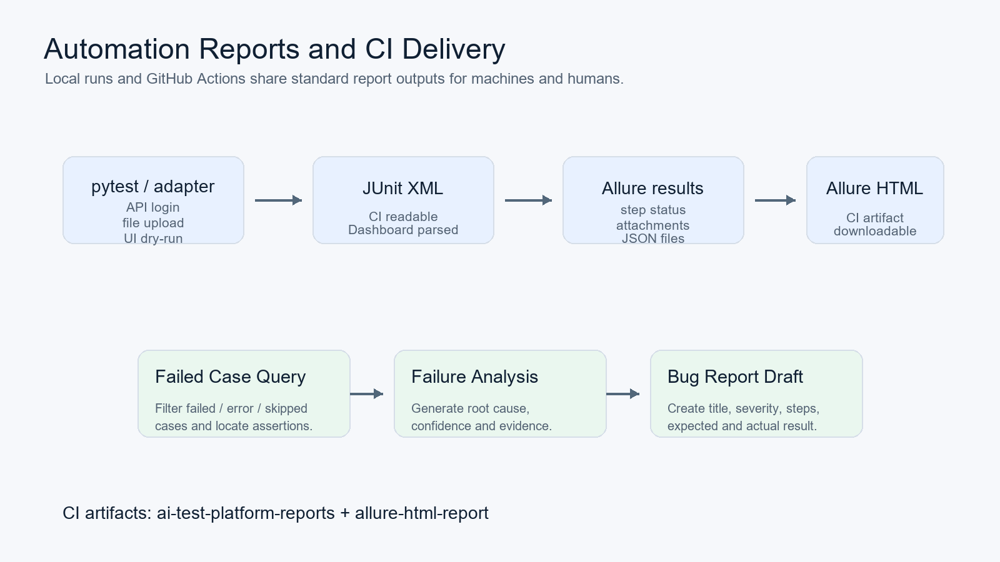

# QualityPilot

[](https://github.com/leo159363/AI-driven-test-automation-platform/actions/workflows/ci.yml)

QualityPilot 是一个基于 **MCP + RAG** 的智能自动化测试平台，面向测试开发场景，支持测试知识检索、测试用例生成、自动化执行、报告解析、失败分析和 Bug 报告草稿生成。

这个项目的目标不是做一个庞大的企业级 TestOps 系统，而是把测试开发实习面试中最容易被追问的链路做成一个可以运行、可以测试、可以展示的工程项目：

```text
文档 / RAG 上下文
  -> 测试用例生成
  -> API / UI 自动化执行
  -> JUnit / Allure 报告
  -> 失败用例查询
  -> 失败原因分析
  -> Bug 报告草稿生成
  -> Dashboard / CI 展示
```

CI 会在 push / pull request 后运行核心回归，并上传 `ai-test-platform-reports` 和 `allure-html-report` artifacts。详情见 [docs/ci_report_artifacts.md](docs/ci_report_artifacts.md)。

## 功能图

### 测试开发闭环


### Dashboard 功能入口

启动 Dashboard 后，可以在一个 Streamlit 工作台中查看端到端 Demo、测试设计、自动化场景、执行计划、测试报告、执行历史和追踪矩阵。



### 自动化报告与 CI 交付



## 核心功能

| 模块 | 当前能力 | 面试时体现的能力 |
| --- | --- | --- |
| RAG 测试上下文 | 支持需求、接口文档、历史 Bug、测试报告、日志等 source type 元数据 | 测试设计有依据，不是凭空生成 |
| MCP Server | 将测试开发动作封装为可编排 tools | 面向 Agent / IDE / 自动化工作流扩展 |
| 测试用例生成 | 根据需求和上下文生成结构化测试用例 | 功能、异常、安全、回归等维度覆盖 |
| API 自动化执行 | 执行登录、文件上传等 API 场景 | pytest、HTTP adapter、执行计划落地 |
| 测试用例管理 | 展示接口/UI 测试用例、自动化状态、pytest 目标和执行命令 | 更接近传统自动化测试平台的用例入口 |
| UI 自动化 dry-run | 将自然语言 UI 步骤转换为 Browser adapter action | 展示 UI 自动化扩展思路，同时保证演示稳定 |
| 测试报告解析 | 解析 JUnit XML，发现 Allure results / Allure report | 自动化测试平台必须能消费报告 |
| 失败用例查询 | 按 failed / error / skipped 筛选失败用例 | 支持失败定位和回归分析 |
| 失败原因分析 | 输出 root cause、confidence、evidence、建议修复 | 从“跑失败”推进到“分析失败” |
| Bug 报告生成 | 生成结构化缺陷草稿和 Markdown | 打通自动化结果到缺陷提交前的链路 |
| Dashboard | 展示 Demo、报告、历史、追踪矩阵、评审和评估 | 体现平台化思路，不是脚本集合 |
| GitHub Actions | 自动运行核心回归并上传报告 artifact | 体现 CI 和工程交付能力 |

## MCP Tools

当前核心 tools：

| Tool | 用途 |
| --- | --- |
| `retrieve_test_context` | 检索测试设计、失败分析、Bug 生成所需上下文 |
| `generate_test_cases` | 从需求和上下文生成结构化测试用例 |
| `run_api_tests` | 执行 API 自动化场景并生成报告路径 |
| `get_test_report` | 解析 JUnit / Allure 测试报告 |
| `query_failed_cases` | 查询失败、错误、跳过用例 |
| `analyze_failure` | 分析失败原因并给出修复建议 |
| `generate_bug_report` | 生成结构化 Bug 草稿和 Markdown |

保留的知识库 tools：

```text
query_knowledge_hub
list_collections
get_document_summary
```

完整参数和输出示例见 [docs/mcp_tools.md](docs/mcp_tools.md)。

## 快速开始

### 1. 安装依赖

```powershell
python -m venv .venv
.\.venv\Scripts\python.exe -m pip install -e ".[dev]"
```

### 2. 运行端到端 Demo

```powershell
.\.venv\Scripts\python.exe scripts\run_qualitypilot_demo.py
```

Demo 会启动一个本地登录接口 stub，真实执行 API 自动化场景，并故意制造一个稳定失败：接口返回 HTTP 200，但缺少需求要求的 `token` 字段。随后平台会解析报告、定位失败用例、分析原因，并生成 Bug 草稿。

运行成功后会看到：

```text
QualityPilot demo completed
execution_status=failed
report_status=failed
failed_case_count=1
bug_count=1
junitxml=reports/qualitypilot-demo/junit.xml
allure_results=reports/qualitypilot-demo/allure-results
summary_json=reports/qualitypilot-demo/demo_summary.json
bug_report_md=reports/qualitypilot-demo/bug_report.md
```

推荐查看这些产物：

| 文件 | 说明 |
| --- | --- |
| `reports/qualitypilot-demo/demo_summary.json` | 端到端链路结构化输出 |
| `reports/qualitypilot-demo/junit.xml` | 标准 JUnit XML 测试报告 |
| `reports/qualitypilot-demo/allure-results/` | Allure-compatible results |
| `reports/qualitypilot-demo/bug_report.md` | 可复制到缺陷平台的 Bug 草稿 |

### 3. 启动 FastAPI 后端

FastAPI 是后续 Vue 前端调用的正式后端 API 层，当前先暴露测试用例、接口列表、自动化场景和测试报告等基础接口：

```powershell
.\.venv\Scripts\python.exe -m uvicorn src.api.main:app --reload --host 127.0.0.1 --port 8000
```

浏览器打开：

```text
http://127.0.0.1:8000/docs
```

第一阶段已提供的核心接口：

| 接口 | 用途 |
| --- | --- |
| `GET /api/health` | 后端健康检查 |
| `GET /api/test-cases` | 测试用例目录 |
| `GET /api/api-endpoints` | 接口测试目录 |
| `GET /api/automation/scenarios` | pytest 自动化场景 |
| `GET /api/reports/latest` | JUnit / Allure 报告发现 |

### 4. 启动 Dashboard

```powershell
.\.venv\Scripts\python.exe scripts\start_dashboard.py --port 8501
```

浏览器打开：

```text
http://127.0.0.1:8501
```

建议优先演示这些页面：

| 页面 | 重点讲什么 |
| --- | --- |
| `QualityPilot Demo` | MCP workflow、RAG contexts、测试用例、失败分析、Bug 草稿 |
| `测试用例管理` | 测试用例列表、接口测试请求、自动化状态、执行命令和报告产物 |
| `测试工作台` | 输入需求，生成带证据的测试设计草稿 |
| `自动化场景` | API 登录、文件上传、UI 登录 dry-run |
| `执行计划` | 自然语言步骤转结构化 action |
| `测试报告` | JUnit XML / Allure 结果解析 |
| `执行历史` | 执行状态、失败原因、报告路径、质量趋势 |
| `追踪矩阵` | 需求、测试点、自动化场景、最近执行状态的覆盖关系 |

### 5. 启动 Vue 前端

Vue 前端是全栈化改造后的正式页面入口，默认调用 `http://127.0.0.1:8000` 的 FastAPI 接口：

```powershell
cd frontend\qualitypilot-web
npm.cmd install
npm.cmd run dev
```

浏览器打开：

```text
http://127.0.0.1:5173
```

当前 Vue 已包含这些页面：

| 页面 | 当前能力 |
| --- | --- |
| `平台总览` | 调用 FastAPI 汇总测试用例、接口、自动化场景和报告产物 |
| `API 测试` | 展示接口目录、接口列表、请求示例、断言和关联用例 |
| `测试用例` | 展示测试用例目录、类型筛选和 pytest 目标 |
| `自动化执行` | 展示可执行 pytest 场景和执行命令 |
| `测试报告` | 展示 JUnit / Allure 报告发现结果 |
| `AI 测试助手` | 先完成页面骨架，后续接入 RAG 和 MCP tools |
| `知识库管理` | 先完成页面骨架，后续接入文档上传和检索 |

### 6. 启动 MCP Server

```powershell
.\.venv\Scripts\mcp-server.exe
```

或：

```powershell
.\.venv\Scripts\python.exe -m src.mcp_server.server
```

### 7. 生成 Allure HTML 报告

```powershell
.\.venv\Scripts\python.exe scripts\generate_allure_report.py
```

本机需要安装 Allure commandline 才能生成 HTML。如果本机没有 Allure CLI，脚本会返回 `missing_cli`；GitHub Actions 会自动安装 Java 和 Allure commandline，并上传 `allure-html-report` artifact。

### 8. 运行核心回归

```powershell
.\.venv\Scripts\python.exe -m pytest tests\unit\test_browser_execution_adapter.py tests\unit\test_execution_result_report_service.py tests\unit\test_execution_history_service.py tests\unit\test_run_execution_plan_script.py tests\unit\test_traceability_service.py tests\unit\test_test_design_review_service.py tests\unit\test_test_design_evaluation_service.py tests\unit\test_test_design_service.py tests\unit\test_api_execution_adapter.py tests\unit\test_execution_plan_service.py tests\automation tests\unit\test_automation_scenario_service.py tests\unit\test_test_report_service.py tests\unit\test_allure_report_service.py tests\unit\test_qualitypilot_demo_dashboard_service.py tests\unit\test_dashboard_config.py tests\e2e\test_dashboard_smoke.py tests\e2e\test_qualitypilot_demo_dashboard_smoke.py tests\e2e\test_mcp_client.py::TestMCPClientE2E::test_initialize_and_tools_list tests\e2e\test_mcp_qualitypilot_workflow.py -v
```

当前收尾验收结果：

```text
CI core regression: 105 passed
QualityPilot demo: completed
Execution plan dry-run: passed
JUnit XML: generated
Allure results: generated
```

## 技术栈

- Python 3.10+
- MCP Server
- RAG ingestion pipeline
- ChromaDB / BM25 / hybrid retrieval
- pytest
- JUnit XML
- Allure-compatible results / Allure HTML artifact
- FastAPI backend
- Vue 3 / Vite / TypeScript frontend
- Streamlit Dashboard
- GitHub Actions CI

## 项目结构

```text
src/
  api/                     # FastAPI 后端接口：给 Vue 前端调用
  mcp_server/
    tools/                  # MCP tools：检索、用例生成、执行、报告、失败分析、Bug 生成
  ingestion/                # 文档入库、切分、向量化、存储
  core/                     # RAG 查询、检索、响应组装
  observability/dashboard/  # Streamlit Dashboard 与测试平台页面
frontend/
  qualitypilot-web/         # Vue 3 + Vite 前端工程
scripts/
  run_qualitypilot_demo.py  # 端到端面试 Demo
  run_automation_suite.py   # 内置自动化场景 runner
  run_execution_plan.py     # 自然语言执行计划 runner
docs/
  mcp_tools.md              # MCP tools 文档
  qualitypilot_demo.md      # 面试 Demo 说明
  final_interview_checklist.md
  project_completion_report.md
tests/
  unit/                     # 核心单元测试
  integration/              # MCP / 服务集成测试
  e2e/                      # 端到端协议测试
  automation/               # 内置自动化测试场景
```

## 面试讲法

可以这样介绍：

> QualityPilot 是一个面向测试开发场景的 MCP + RAG 智能自动化测试平台。我把测试开发常见链路拆成多个 MCP tools：先检索需求和接口文档上下文，再生成测试用例，然后执行 API 自动化测试，生成 JUnit / Allure 报告。报告失败后，平台会查询失败用例，结合上下文分析失败原因，并生成结构化 Bug 草稿。项目重点不是做一个大而全的企业系统，而是把“测试设计、自动化执行、报告解析、失败分析、缺陷草稿”这条闭环做清楚、跑得通、能测试。

简历可写：

```text
基于 Python、MCP、RAG、pytest、JUnit XML、Allure 和 Streamlit 实现智能自动化测试平台，封装测试上下文检索、用例生成、API 自动化执行、报告解析、失败用例查询、失败原因分析和 Bug 草稿生成等 MCP tools，并提供 Dashboard 和 GitHub Actions CI，打通从需求到缺陷报告的测试开发闭环。
```

## 当前边界

- 当前不是完整企业级 TestOps 平台，没有复杂权限、任务调度、多环境管理和外部缺陷系统写入。
- 失败分析和 Bug 生成目前以规则兜底为主，保证本地和 CI 稳定；后续可以接入 LLM 做总结增强。
- UI 自动化默认支持 dry-run，真实 Playwright 浏览器执行需要额外安装浏览器运行环境。
- Allure 已支持 results 生成、HTML 生成脚本和 GitHub Actions HTML artifact；本地是否能生成 HTML 取决于是否安装 Allure CLI。
- Demo 使用本地 stub 服务制造稳定失败，便于面试现场复现。

## 更多文档

- [MCP Tools 文档](docs/mcp_tools.md)
- [QualityPilot Demo 说明](docs/qualitypilot_demo.md)
- [CI 报告 artifact 说明](docs/ci_report_artifacts.md)
- [面试前检查清单](docs/final_interview_checklist.md)
- [项目完成报告](docs/project_completion_report.md)
