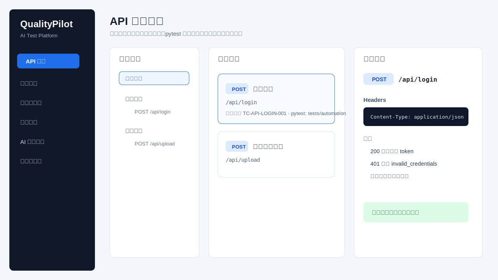
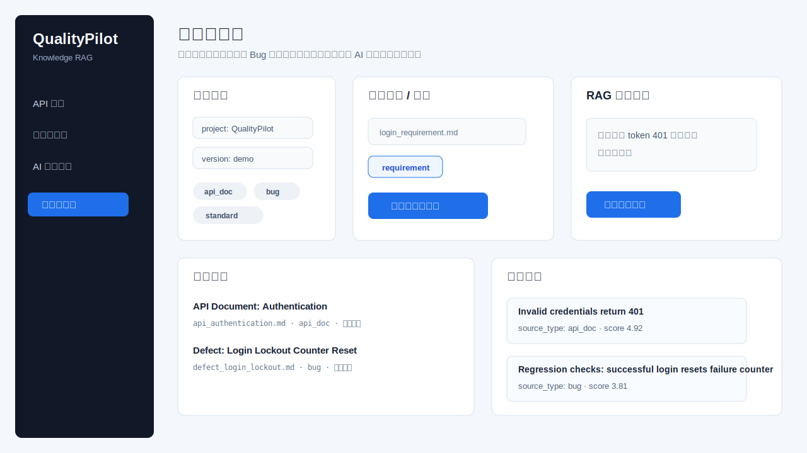
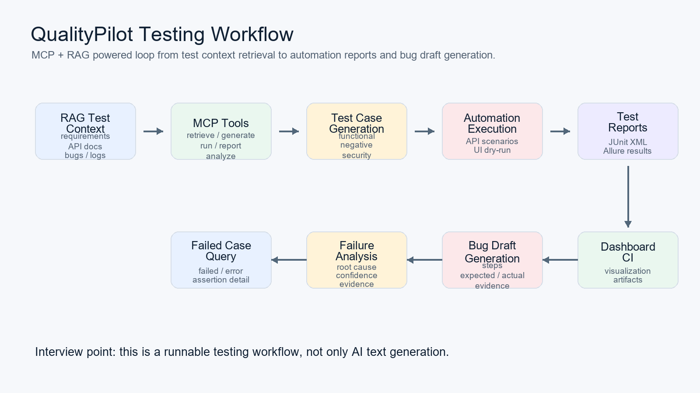

# QualityPilot

[](https://github.com/leo159363/AI-driven-test-automation-platform/actions/workflows/ci.yml)

QualityPilot 是一个面向测试开发场景的 **MCP + RAG 智能自动化测试平台**。项目目标是做成接近真实测试平台的全栈项目：既有接口测试、测试用例、自动化执行、报告中心、AI 助手和知识库，也保留 MCP / RAG 作为差异化能力。

核心闭环：

```text
测试知识入库 -> RAG 检索 -> AI 生成测试用例
  -> pytest 自动化执行 -> JUnit / Allure 报告解析
  -> 失败原因分析 -> Bug 报告草稿生成
  -> Vue / Dashboard / CI 展示
```

## 项目亮点

| 能力 | 当前实现 | 面试价值 |
| --- | --- | --- |
| Vue + FastAPI 全栈 | Vue 3 页面调用 FastAPI 后端接口 | 比纯脚本更像真实测试平台 |
| API 测试中心 | 支持接口目录、环境变量、Query Params、Headers、Body、Mock、断言、cURL、AI 用例裂变和编排预览 | 对齐 Postman / Apifox / FullScopeTest 类测试平台 |
| 自动化执行 | 页面触发后端执行 pytest 场景并生成报告产物 | 体现测试执行平台化能力 |
| 报告解析 | 解析 JUnit XML，发现 Allure results / report | 自动化平台必须能消费测试结果 |
| MCP tools | 封装检索、用例生成、执行、报告、失败分析、Bug 生成 | 体现 Agent / IDE 可编排能力 |
| RAG 知识库 | 支持需求、接口文档、历史 Bug、测试报告、日志、规范等 source type | AI 输出有依据，不是凭空生成 |
| AI 测试助手 | 支持用例生成、接口测试设计、失败分析、Bug 报告、可测性分析 | 更贴合测试开发实际工作 |
| CI/CD | GitHub Actions 运行回归并上传报告 artifact | 体现持续集成和工程交付意识 |

## 功能图

### Vue API 测试中心



### Vue 自动化执行与报告


### Vue 知识库与 RAG 检索



### 测试开发闭环



## 技术栈

| 层 | 技术 |
| --- | --- |
| 前端 | Vue 3、Vite、TypeScript、Vue Router |
| 后端 | FastAPI、Pydantic、Uvicorn |
| MCP | MCP Server、tool schema、结构化 JSON 输出 |
| RAG | 文档切分、source type 元数据、检索上下文、可替换向量库 |
| 自动化测试 | pytest、接口测试 adapter、UI dry-run adapter |
| 报告 | JUnit XML、Allure-compatible results、Allure HTML artifact |
| Dashboard | Streamlit 旧版演示工作台，保留用于快速 demo |
| CI | GitHub Actions、ruff、pytest、Allure artifact |

## 快速开始

### 1. 安装 Python 依赖

```powershell
python -m venv .venv
.\.venv\Scripts\python.exe -m pip install -e ".[dev]"
```

### 2. 安装 Vue 依赖

```powershell
cd frontend\qualitypilot-web
npm.cmd install
```

### 3. 推荐：一键启动前后端

在项目根目录执行：

```powershell
.\.venv\Scripts\python.exe scripts\start_fullstack.py
```

启动成功后访问：

```text
http://127.0.0.1:5173
```

这个脚本会同时启动 FastAPI 和 Vue，并把 Vue 的 `/api` 请求代理到 FastAPI。不要只启动 Vue，否则页面会出现 `Failed to fetch` 或数据全是 0。

如果 `8000` 或 `5173` 被其他程序占用，可以换端口：

```powershell
.\.venv\Scripts\python.exe scripts\start_fullstack.py --api-port 8010 --web-port 5174
```

### 4. 手动启动 FastAPI 后端

在项目根目录执行：

```powershell
.\.venv\Scripts\python.exe -m uvicorn src.api.main:app --host 127.0.0.1 --port 8000
```

后端接口文档：

```text
http://127.0.0.1:8000/docs
```

### 5. 手动启动 Vue 前端

另开一个终端：

```powershell
cd frontend\qualitypilot-web
npm.cmd run dev
```

前端页面：

```text
http://127.0.0.1:5173
```

注意：开发服务需要保持终端不关闭。FastAPI 默认端口是 `8000`，Vue 默认端口是 `5173`。

## 推荐演示路线

第一次使用可以先看 [docs/how_to_use_qualitypilot.md](docs/how_to_use_qualitypilot.md)，里面按页面顺序写了怎么点、怎么看、面试怎么讲。每个模块具体填什么测试数据，看 [docs/module_test_data_guide.md](docs/module_test_data_guide.md)。

1. 打开 Vue 首页，说明这是一个测试开发平台原型。
2. 进入 `API 测试`，展示接口目录、请求样例、断言、关联测试用例和 pytest 目标。
3. 在 `API 测试` 页面选择环境，编辑变量、Headers、Query Params、Body，发送请求并查看状态码断言和 JSON 字段断言结果。
4. 点击 `AI 裂变用例`，从一个接口自动生成正常、异常、边界和安全类用例；点击 `导出 cURL` 查看可复制的命令。
5. 进入 `测试用例`，说明平台维护了功能、异常、安全、回归等维度的用例。
6. 进入 `自动化执行`，选择 `api_login` 或 `api_file_upload` 触发后端 pytest。
7. 进入 `测试报告`，展示 JUnit / Allure 产物路径和执行结果。
8. 进入 `知识库管理`，上传需求或接口文档，输入 Query 检索上下文。
9. 进入 `AI 测试助手`，选择提示词模板，生成用例、失败分析或 Bug 报告草稿。
10. 最后说明 MCP tools 如何把这些能力开放给 Agent / IDE / 自动化工作流。

## 主要后端接口

| 接口 | 用途 |
| --- | --- |
| `GET /api/health` | 后端健康检查 |
| `GET /api/test-cases` | 测试用例目录 |
| `GET /api/api-endpoints` | API 测试接口目录 |
| `GET /api/api-testing/environments` | API 测试环境变量与公共 Headers |
| `POST /api/api-testing/debug` | 受控接口调试，支持状态码和 JSON 字段断言 |
| `POST /api/api-testing/synthesize` | 根据当前请求生成正常、异常、边界、安全类接口用例 |
| `POST /api/api-testing/plan` | 根据自然语言生成接口测试编排计划预览 |
| `POST /api/api-testing/curl` | 导出当前请求的 cURL 命令 |
| `GET /api/automation/scenarios` | 自动化测试场景 |
| `POST /api/automation/run` | 触发 pytest 自动化执行 |
| `GET /api/automation/runs` | 查询执行历史 |
| `GET /api/reports/latest` | 查询最新 JUnit / Allure 报告 |
| `GET /api/reports/{run_id}` | 查询单次执行报告 |
| `GET /api/assistant/templates` | AI 测试助手提示词模板 |
| `POST /api/assistant/chat` | 生成测试产物 |
| `GET /api/knowledge/source-types` | 知识来源类型字典 |
| `GET /api/knowledge/sources` | 知识库来源列表 |
| `POST /api/knowledge/search` | RAG 检索测试 |
| `POST /api/knowledge/upload` | 上传文档并切分入库 |

## MCP Tools

| Tool | 用途 |
| --- | --- |
| `retrieve_test_context` | 检索测试设计、失败分析、Bug 生成所需上下文 |
| `generate_test_cases` | 根据需求和上下文生成结构化测试用例 |
| `run_api_tests` | 执行 API 自动化场景并生成报告路径 |
| `get_test_report` | 解析 JUnit / Allure 测试报告 |
| `query_failed_cases` | 查询 failed / error / skipped 用例 |
| `analyze_failure` | 分析失败原因并给出修复建议 |
| `generate_bug_report` | 生成结构化 Bug 草稿和 Markdown |

完整说明见 [docs/mcp_tools.md](docs/mcp_tools.md)。

## 运行自动化测试

运行端到端 demo：

```powershell
.\.venv\Scripts\python.exe scripts\run_qualitypilot_demo.py
```

运行单个自动化场景：

```powershell
.\.venv\Scripts\python.exe scripts\run_automation_suite.py --scenario api_login
.\.venv\Scripts\python.exe scripts\run_automation_suite.py --scenario api_file_upload
```

运行核心单元测试：

```powershell
.\.venv\Scripts\python.exe -m ruff check src tests
.\.venv\Scripts\python.exe -m pytest tests\unit -v
```

构建 Vue：

```powershell
cd frontend\qualitypilot-web
npm.cmd run build
```

## 项目结构

```text
src/
  api/                     # FastAPI 后端接口，供 Vue 前端调用
  mcp_server/
    tools/                  # MCP tools：检索、用例生成、执行、报告、失败分析、Bug 生成
  ingestion/                # 文档入库、切分、向量化、存储
  core/                     # RAG 查询、检索、响应组装
  observability/dashboard/  # Streamlit Dashboard 旧版演示页面
frontend/
  qualitypilot-web/         # Vue 3 + Vite + TypeScript 前端
scripts/
  start_fullstack.py        # 启动 FastAPI + Vue
  run_qualitypilot_demo.py  # 端到端演示
  run_automation_suite.py   # 自动化场景 runner
docs/
  mcp_tools.md              # MCP tools 文档
  interview_playbook.md     # 面试讲解手册
  stage_*.md                # 分阶段开发记录
tests/
  unit/                     # 单元测试
  integration/              # 集成测试
  e2e/                      # 端到端测试
  automation/               # 内置自动化测试场景
```

## 面试讲法

可以这样介绍：

> QualityPilot 是我为了测试开发实习面试做的一个智能自动化测试平台。它不是单纯调用大模型聊天，而是把需求、接口文档、历史 Bug、测试报告等资料先沉淀成测试知识库，再通过 RAG 检索给用例生成和失败分析提供依据。平台前端使用 Vue，后端使用 FastAPI，自动化执行基于 pytest，报告支持 JUnit / Allure，同时把核心动作封装成 MCP tools，方便 Agent 或 IDE 调用。

更完整的讲解稿见 [docs/interview_playbook.md](docs/interview_playbook.md)。

## 当前边界

- 当前 Vue 前端是测试平台原型，重点展示测试开发闭环，不是完整企业权限系统。
- 知识库页面当前使用稳定可演示的关键词检索，服务层已经按 RAG 结构设计，后续可替换为 Chroma / FAISS / Milvus。
- UI 自动化当前保留 dry-run adapter，主要展示执行计划和平台扩展思路。
- Allure HTML 需要本机安装 Allure CLI；CI 中会自动生成 artifact。
